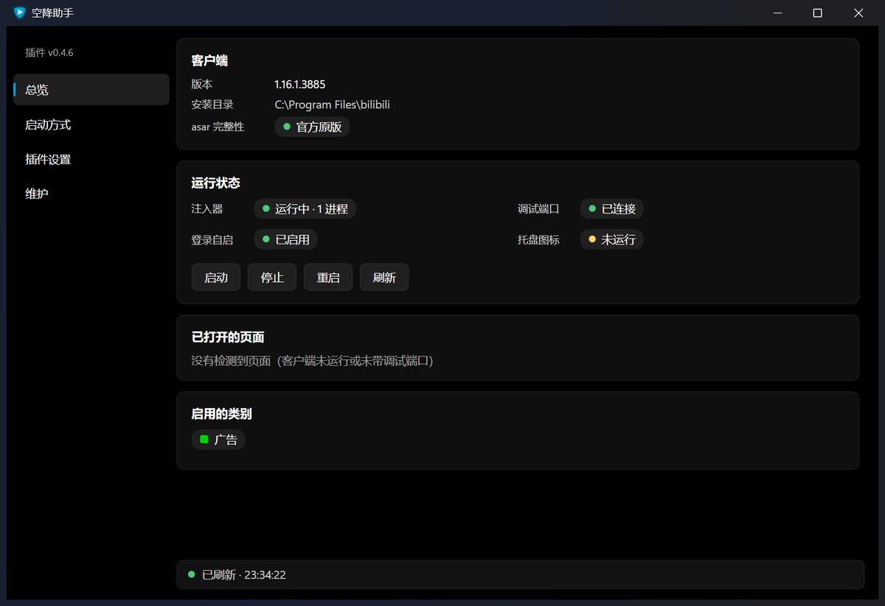

# 空降助手 · 哔哩哔哩 PC 客户端注入

在**官方哔哩哔哩 Windows 客户端**里用上 [BilibiliSponsorBlock](https://github.com/hanydd/BilibiliSponsorBlock)
（小电视空降助手）的能力：自动跳过 / 静音赞助片段、片头片尾、三连提醒等。

**不修改客户端任何文件**——通过 Chrome DevTools 协议（CDP）在运行时把脚本注入页面，
所以官方客户端更新后不需要重新打补丁，asar 校验也不会被破坏。



## 特性

- **自动空降**：按 `bvid + cid` 从 `bsbsb.top` 取片段，支持跳过 / 静音 / 整段标签 / 高光四种动作
- **类别开关**：广告、无偿推广、三连提醒、开场动画、片尾鸣谢、预告回顾、离题闲聊、非音乐部分、
  精彩时刻、填充片段，逐个可控
- **播放页 UI**：进度条 4px 彩色片段条、控制栏 `BSB` 按钮、悬浮面板（片段列表 / 类别开关 / 保存更改）、
  空降时的临时提示（可撤销）
- **官方设置页集成**：主界面「设置 → 空降助手」，风格与官方设置一致
- **无感启动**：快捷方式就地带上调试端口，注入器登录时隐藏启动，照旧点原来的图标即可
- **图形安装器**：原生 Win11 云母风格窗口，改端口 / 启动入口 / 插件设置 / 维护都在里面
- **托盘图标**：状态、启停注入器、打开安装器与日志
- 不装浏览器扩展、不常驻浏览器、不改官方包、不碰你的账号数据

## 工作原理

```
哔哩哔哩.exe (Electron)                     注入器 (Node)
   │  --remote-debugging-port=9222              │
   │  ◄───────── CDP WebSocket ────────────────┤  1.5s 轮询 /json/list
   │                                            │
   ├─ index.html  ← bsb-content / bsb-ui / bsb-settings
   └─ player.html ← 同上（解析 URL 里的 bvid+cid，
                     查 bsbsb.top，改 video.currentTime / muted）
```

- 客户端页面由官方自己加载，注入器只往里塞三个脚本；脚本带版本号，
  页面里是旧版本时自动接管（旧实例的定时器自行退出）。
- 配置：页面 `localStorage` 是生效值，`%LOCALAPPDATA%\bsb-client-patcher\bsb-config.json` 是默认值。
- 安装器不直连 CDP：它写一个命令文件，由注入器在下一轮轮询时下发到页面。

## 安装

### 前置

| 需要 | 说明 |
|------|------|
| Windows 10/11 + 官方哔哩哔哩 PC 客户端 | 客户端从官网装，本项目不分发 |
| Node 18+ | 注入器用；`winget install OpenJS.NodeJS.LTS` |
| .NET 8 SDK（可选） | 只有想自己构建安装器 / 托盘 exe 时才需要 |

### 步骤

```powershell
git clone https://github.com/nekwken/bsb-pc-injector.git BSB
cd BSB

# 1) 构建主程序（可选，但推荐：有托盘图标和设置窗口）
powershell -ExecutionPolicy Bypass -File .\build-apps.ps1

# 2) 安装运行时模式：改写快捷方式带上调试端口 + 注册隐藏自启
powershell -ExecutionPolicy Bypass -File .\enable-seamless.ps1
#    系统级开始菜单快捷方式需要管理员，想一起改就再用管理员身份跑一次

# 3) 照旧打开哔哩哔哩，播放视频即可
```

没有构建 exe 也能用：`enable-seamless.ps1` 会自动退回「只起注入器」模式（只是没有托盘图标和图形安装器）。

### 验证

```powershell
powershell -ExecutionPolicy Bypass -File .\status.ps1
```

应看到：注入器 1 个进程、`9222` 端口 open、各启动入口都带调试端口。

## 使用

- **播放页**：鼠标移到画面上 → 分辨率控件左侧的 **BSB** → 悬浮面板
- **完整设置**：主界面 **设置 → 空降助手**
- **主程序**：双击 `bin\BSB.exe`（托盘常驻 + 设置窗口，同一个 exe）
- **托盘**：右键图标可启停注入器 / 打开安装器 / 看日志；有插件新版本时会提示
- 注入器日志：`%LOCALAPPDATA%\bsb-client-patcher\logs\injector.log`

## 卸载

```powershell
# 停用自启与托盘，停掉注入器（官方客户端从未被修改，停掉即原版）
powershell -ExecutionPolicy Bypass -File .\enable-seamless.ps1 -Uninstall

# 若之前改过系统级快捷方式，把它改回来（去掉调试端口参数）
powershell -ExecutionPolicy Bypass -File .\enable-seamless.ps1 -Uninstall -CleanShortcuts
```

官方客户端从未被修改，卸载后它就是原版。

## 常见问题

| 现象 | 处理 |
|------|------|
| 播放页没有 BSB 按钮 / 色条 | `status.ps1` 看注入器是否在跑、9222 是否 open；确认客户端是从**带调试端口**的快捷方式启动的 |
| 按钮一闪一闪 | 同时跑了多个注入器。跑一次 `start-injector.ps1`（会先杀掉旧的），再重启客户端 |
| 进度条没有色条 | 该视频在 `bsbsb.top` 上确实没有片段（面板会显示「当前视频暂无片段」） |
| 从开始菜单启动没有效果 | 那个快捷方式在 `C:\ProgramData`，需要管理员才能改写：用管理员跑一次 `enable-seamless.ps1` |
| 安装器打不开 | 需要 .NET 8 Desktop 运行时；或先 `build-apps.ps1` 重新构建 |

更多排查见 `docs/workflow.md`。

## 开发

```
payload/     注入到页面的脚本（GPL-3.0，改自上游扩展）
runtime/     injector.mjs（CDP 注入器）+ 隐藏启动用的 vbs
tools/       PowerShell 后端（状态采集、快捷方式、提权、动作分发）
apps/        Installer（WPF / Mica）、Tray（WinForms）两个原生应用
docs/        设计与使用文档
research/    前期调研笔记（不含官方客户端产物）
```

改了 `payload/` 记得同时把版本号 +1（`payload/manifest.json`、`bsb-ui.js` 的 `VERSION`、
`bsb-settings.js` 的 `SELF_VERSION`），否则已经在跑的页面不会换代码。

## 免责声明

- 本项目与哔哩哔哩官方**没有任何关系**，不是官方产品。
- 跳过的片段由社区标注（`bsbsb.top`），可能与平台的商业化内容冲突；使用前请自行评估，
  包括是否违反你与平台之间的服务条款。风险自负。
- 本项目不修改官方客户端文件，也不分发官方客户端安装包。
- 请勿用于商业用途或大规模分发。

## 许可与致谢

本项目以 **GPL-3.0** 发布（见 `LICENSE`）：它是
[BilibiliSponsorBlock](https://github.com/hanydd/BilibiliSponsorBlock)（GPL-3.0）的衍生作品，
跳片段协议、类别定义、界面思路与图标都来自上游。修改说明见 `NOTICE.md`。

感谢上游作者与所有片段标注者。
